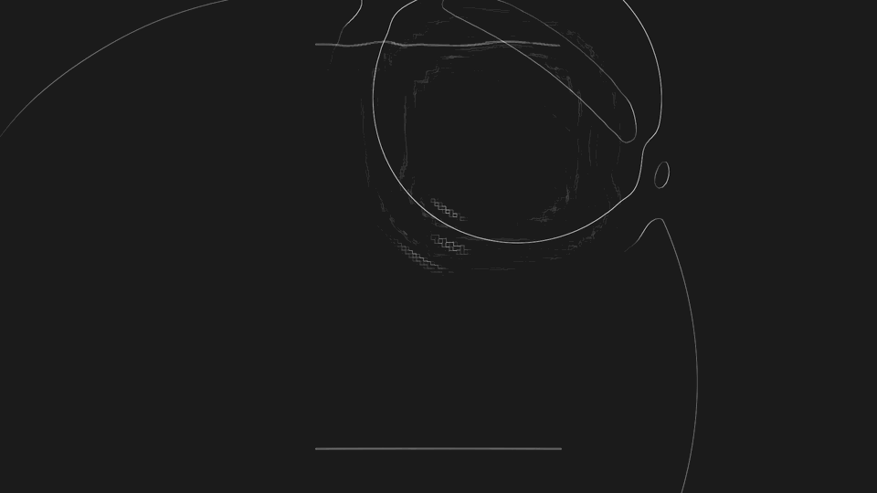
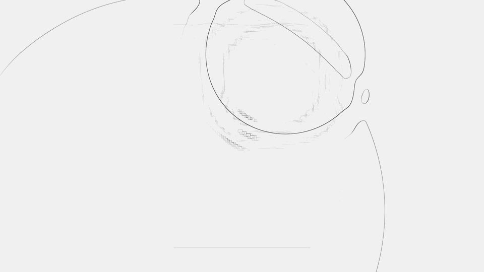

# Ink Water

**A water study rendered in ink.**



Simulated water, drawn instead of rendered. The surface is still driven by a real-time water simulation; Ink Water only changes how that surface is put on the page — as etching, graphite, ink wash, bitmap texture and projected light.

**[Play with it → demo.1001ud.me/ink-water](https://demo.1001ud.me/ink-water/)**

## Interaction

- **Click or drag** — disturb the water
- **H** — show or hide the controls
- **Space** — pause
- **C**, **X**, **/** — replay the same gesture, exactly, every time

## Drawing water

The view looks straight down at a sheet of water that fills the screen. Every frame, the simulation produces a surface: heights, slopes and the light those slopes refract onto the floor below. The drawing reads that surface and decides how to mark the paper — contour lines where the height changes, darker strokes on steep slopes, a wash where light gathers.

Nothing about the water changes between styles. Switch from **Original**, the photographic pool the simulation was written for, to **Etching**, and the same ripples keep moving; they are only drawn differently. [The launch video](assets/ink-water-launch.mp4) does exactly that.



Two faint lines lie on the floor beneath the water. They are there for the ripples to bend, the way the lines of a pool wobble when someone dives in.

## Lineage

```
2010  Evan Wallace          WebGL Water
                            heightfield water, raytraced reflections and refractions, caustics
  ↓
2026  Yong Su (jeantimex)   threejs-water, a Three.js port
  ↓
2026  Ink Water             the same water, drawn
```

**Evan Wallace — [WebGL Water](https://madebyevan.com/webgl-water/), 2010.** One of the classic browser graphics demos: a heightfield water simulation with raytraced reflections and refractions, soft shadows and caustics, running on the GPU. Wallace describes it as "an experiment in realtime water rendering with WebGL." It predates Figma, which he went on to co-found; Figma has written that before co-founding the company he "experimented with WebGL in order to build confidence in the technology," and [illustrates that with this demo](https://www.figma.com/blog/figma-rendering-powered-by-webgpu/).

**Yong Su ([jeantimex](https://github.com/jeantimex)) — [threejs-water](https://github.com/jeantimex/threejs-water), 2026.** In its own words, "a complete port of Evan Wallace's WebGL Water demo to Three.js, with significant enhancements including support for Three.js geometries, customizable pool shapes, and GLTF model loading." Ink Water is built directly on this port.

**Ink Water.** The simulation underneath is theirs: Wallace's heightfield wave model, by way of Yong Su's port, with its solver, optics and original shaders kept byte-for-byte. Where those projects pushed toward realism, Ink Water goes the other way and asks what the same moving surface looks like as drawing and printmaking. What it adds is the view, the drawing and the interaction:

- a perfectly overhead view, cropped so the water fills the screen
- Etching, Graphite and Ink wash drawing, with projected caustics carried into the monochrome image
- bitmap and dither layers, and a separate set of print experiments
- an open-water edge pass, so waves leave the frame instead of echoing back from tank walls
- Dreamy rain timing on its own clock, while touches stay at full speed
- repeatable C, X and / gestures for comparing styles

## Experiments

The controls hold more than the defaults show:

- **Etching, Graphite, Ink wash** — three ways of inking the same surface, on light, silver or dark paper.
- **Projected caustics** — the light the waves focus onto the floor, drawn into the image rather than painted over it.
- **Bitmap layers** — comic dithering, a dot field revealed by caustic light, grain bent by the water's normals, soft diffusion.
- **Print experiments** — ripples made of printed marks, a print that surfaces where waves pass, and a print refracted by the water.
- **Caustic ripples** — the caustic shapes themselves become the ink.
- **Dreamy, Subtle, Dreamy rain speed** — slower motion, lighter impacts, and rain that drifts in pace while your touches stay at 100%.

## How it works

The water is a 256×256 heightfield on the GPU, the linear wave model from Evan Wallace's original. Each step updates height and velocity textures; normals come from the height gradient, and caustics come from projecting refracted light through the surface onto the floor. Ink Water adds an absorbing boundary pass at the edges, so the visible water behaves like part of a larger body.

The drawing is a separate pass. It reads the rendered scene and the heightfield and turns them into paper and ink. Drawing, bitmap and print layers are presentation only — no drawing buffer ever feeds back into the simulation.

It is a heightfield, not a Navier–Stokes fluid: no breaking waves, spray or flow. As Wallace put it about the original, "the focus was on the rendering aspect, not on the simulation."

## Process

Build process — the working prompt/specification is preserved in [PROMPT.md](PROMPT.md).

## Run locally

Requires Node 20 or newer.

```
npm ci
npm run dev      # http://localhost:4173
npm test
npm run build    # static site in dist/
```

`npm run social` re-renders the GIFs, videos and social image from the real app; it needs Google Chrome and ffmpeg.

## Technical notes

Restoration history, the exact-base file hashes, the open-water boundary, the rain field, shader details and the full test suite are in [docs/technical-notes.md](docs/technical-notes.md).

The one-song music-synchronized rain experiment, playback instructions and artistic score are documented in [docs/marumari-rain.md](docs/marumari-rain.md). Music Sync is Off by default.

## Credits

- **Original WebGL Water** — [Evan Wallace](https://madebyevan.com/), 2010 ([demo](https://madebyevan.com/webgl-water/), [source](https://github.com/evanw/webgl-water))
- **Three.js port** — Yong Su ([jeantimex](https://github.com/jeantimex)), 2026 ([threejs-water](https://github.com/jeantimex/threejs-water))
- **Tile texture** (Original mode) — [zooboing on Flickr](https://www.flickr.com/photos/zooboing/3682834083/), as credited by both upstream projects; the sky cube map also comes from upstream
- **Ink Water** — drawing, interaction and presentation layers by [lekandigital](https://github.com/lekandigital)

MIT License. The original notices are retained in [LICENSE](LICENSE): Original work Copyright (c) 2011 Evan Wallace; Modified work Copyright (c) 2026 Yong Su.
